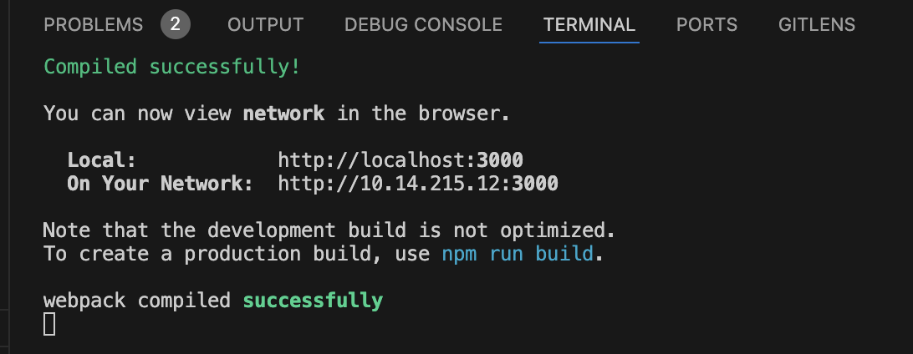

# Getting Started with Create React App

This project was bootstrapped with [Create React App](https://github.com/facebook/create-react-app).

## Available Scripts

In the project directory, you can run:

### `npm start`

Runs the app in the development mode.\
Open [http://localhost:3000](http://localhost:3000) to view it in your browser.

The page will reload when you make changes.\
You may also see any lint errors in the console.

### `npm test`

Launches the test runner in the interactive watch mode.\
See the section about [running tests](https://facebook.github.io/create-react-app/docs/running-tests) for more information.

### `npm run build`

Builds the app for production to the `build` folder.\
It correctly bundles React in production mode and optimizes the build for the best performance.

The build is minified and the filenames include the hashes.\
Your app is ready to be deployed!

See the section about [deployment](https://facebook.github.io/create-react-app/docs/deployment) for more information.

### `npm run eject`

**Note: this is a one-way operation. Once you `eject`, you can't go back!**

If you aren't satisfied with the build tool and configuration choices, you can `eject` at any time. This command will remove the single build dependency from your project.

Instead, it will copy all the configuration files and the transitive dependencies (webpack, Babel, ESLint, etc) right into your project so you have full control over them. All of the commands except `eject` will still work, but they will point to the copied scripts so you can tweak them. At this point you're on your own.

You don't have to ever use `eject`. The curated feature set is suitable for small and middle deployments, and you shouldn't feel obligated to use this feature. However we understand that this tool wouldn't be useful if you couldn't customize it when you are ready for it.

## Learn More

You can learn more in the [Create React App documentation](https://facebook.github.io/create-react-app/docs/getting-started).

To learn React, check out the [React documentation](https://reactjs.org/).

### Code Splitting

This section has moved here: [https://facebook.github.io/create-react-app/docs/code-splitting](https://facebook.github.io/create-react-app/docs/code-splitting)

### Analyzing the Bundle Size

This section has moved here: [https://facebook.github.io/create-react-app/docs/analyzing-the-bundle-size](https://facebook.github.io/create-react-app/docs/analyzing-the-bundle-size)

### Making a Progressive Web App

This section has moved here: [https://facebook.github.io/create-react-app/docs/making-a-progressive-web-app](https://facebook.github.io/create-react-app/docs/making-a-progressive-web-app)

### Advanced Configuration

This section has moved here: [https://facebook.github.io/create-react-app/docs/advanced-configuration](https://facebook.github.io/create-react-app/docs/advanced-configuration)

### Deployment

This section has moved here: [https://facebook.github.io/create-react-app/docs/deployment](https://facebook.github.io/create-react-app/docs/deployment)

### `npm run build` fails to minify

This section has moved here: [https://facebook.github.io/create-react-app/docs/troubleshooting#npm-run-build-fails-to-minify](https://facebook.github.io/create-react-app/docs/troubleshooting#npm-run-build-fails-to-minify)

 

# How to access the app on a mobile device
## Quick Guide
After running `npm start` you will be automatically directed to your browser. After the application opens on your browser, return to your terminal. In your terminal, you should find two lines labeled `Local:` & `On Your Network:`. If you copy the URL from the `On Your Network` line and paste it into your mobile browser, it should open the React application.
### Terminal Example

 

## Step by step
### Mac
* **Step 1:**
Make sure the desktop device that the app is running on and your mobile device are connected to the same network

* **Step 2:**
Open Settings

* **Step 3:**
Open the `Wi-Fi` menu

* **Step 4:**
Click `Detials`. Alternatively, you can click this icon: 
•••
 &nbsp;&nbsp;then click `Network settings...`

* **Step 5:**
Find your IP address for that network Under the `IP address` section. Example IP: `10.14.215.12`

* **Step 6:**
On your mobile device, open a browser and enter the IP address followed by a colon and the port that the React app runs on. This project runs on port 3000. Example: `10.14.215.12:3000`

* **Note:**
With the current implementation of the application, it is likely that any database interactions with DynamoDB will not work when accessing the app on your mobile device

### Windows
* **Step 1:** Make sure the desktop device that the app is running on and your mobile device are connected to the same network

* **Step 2:** 
Open Settings

* **Step 3:** 
Open the `Network & Internet` menu

* **Step 4:** 
Click the Wifi network that your desktop and mobile device are connected to.

* **Step 5:** 
Under `Properties`, scroll down to see the `IPv4 address` row to find your IP address for that network. Example IP: `10.14.200.10`

* **Step 6:** 
On your mobile device, open a browser and enter the IP address followed by a colon and the port that the React app runs on. This project runs on port 3000. Example: `10.14.200.10:3000`

* **Note:** 
With the current implementation of the application, it is likely that any database interactions with DynamoDB will not work when accessing the app on your mobile device